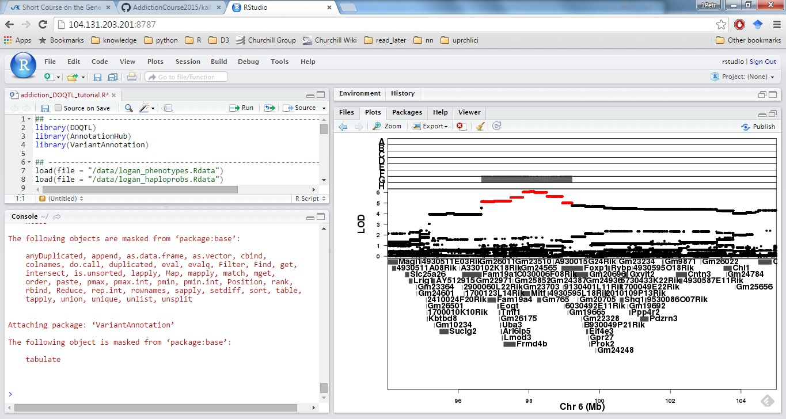
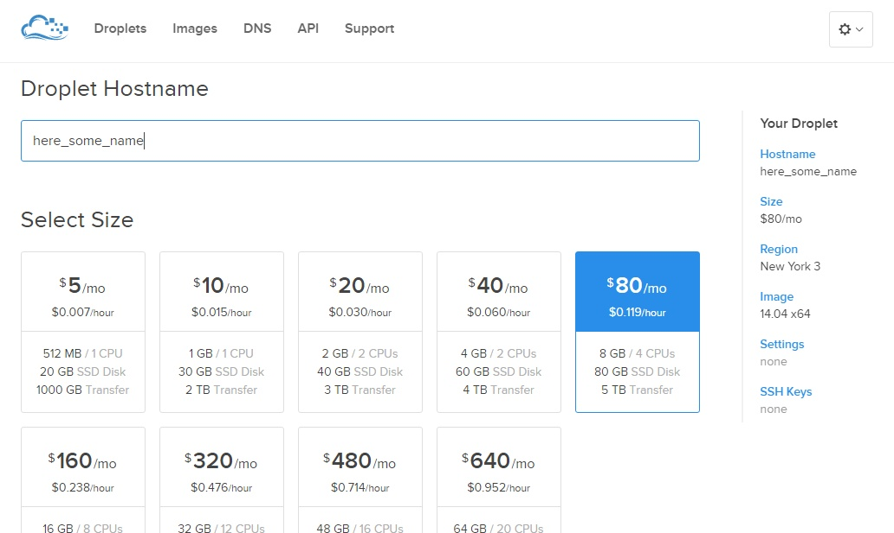
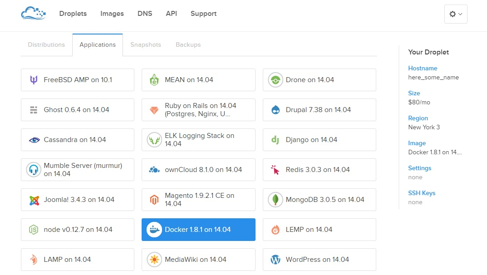

# Short Course On The Genetics Of Addiction

This is a directory for 2-hour bioinformatic workshop on [Short Course On The Genetics Of Addiction](https://www.jax.org/education-and-learning/education-calendar/2015/august/short-course-on-the-genetics-of-addiction) (August 27, 2015) at [The Jackson Laboratory](http://www.jax.org) that includes the following tutorials:

* __kallisto & EMASE__ (KB Choi & N Raghupathy): generate an index, pseudo-align reads and quantify the expression [kallisto_emase_tutorial.sh](https://github.com/simecek/AddictionCourse2015/blob/master/scripts/kallisto_emase_tutorial.sh)
* __DOQTL__ (D Gatti): kinship matrix, linkage and association mapping [addiction_DOQTL_tutorial.Rmd](https://github.com/simecek/AddictionCourse2015/blob/master/scripts/addiction_DOQTL_tutorial.Rmd) 
* __DESeq2__ (N Raghupathy): detect differential expression between groups of RNASeq samples [DESeq2_tutorial.R](https://github.com/simecek/AddictionCourse2015/blob/master/scripts/DESeq2_tutorial.R) 

The participants use their web browsers to connect to customized [Docker](https://docs.docker.com/) containers hosted on [Digital Ocean](https://www.digitalocean.com/?refcode=673c97887267) virtual machines (see screen captures below).

 | 

Docker is a lightweight container virtualization platform. We created two Docker images for this course: [simecek/addictioncourse2015](https://github.com/simecek/AddictionCourse2015/blob/master/Dockerfile) (RStudio, DOQTL, DESeq2) and [kbchoi/asesuite](https://github.com/simecek/AddictionCourse2015/blob/master/Dockerfile_asesuite) (kallisto, EMASE).  You can run docker containers on your computer or in the cloud environments like AWS, Digital Ocean, Microsoft Azure or Google Cloud. [Dockerfile](https://github.com/simecek/AddictionCourse2015/blob/master/Dockerfile_asesuite) can be also used as a list of instructions how to install the software on your computer.

## How to start Digital Ocean droplet?

Here, I will give a description how our virtual machines have been created. You can either create a machine manually on Digital Ocean, SSH to it and start the docker containers. Or you can use [R/analogsea](https://github.com/sckott/analogsea) package to start a droplet from a command line. 

In both cases, first, create an account on [Digital Ocean](https://www.digitalocean.com/?refcode=673c97887267). You should get $10 promotional credit that currently corresponds to free 3.5 days of 8GB machine running expense.

### For beginners - create a virtual machine manually

* Log into your Digital Ocean account. Click on "Create Droplet" button. Choose any droplet hostname and select its size - 8GB memory, 4 CPU, $0.119/hour. 

   

   
Scroll down to "Select image", click on 'Applications' tab and select Docker. Click on "Create Droplet" button. Droplet now starts in 1-2 minutes. You should receive an email with a password.   
   



* Note down your droplet's IP.ADDRESS. SSH into your droplet (`ssh root@DROPLET.IP.ADDRESS`) and pull docker images
```{r}
  docker pull rocker/hadleyverse
  docker pull simecek/addictioncourse2015
  docker pull kbchoi/asesuite
```
* Next, download required datasets (~30 minutes)
```{r}
  mkdir -p /sanger
  chmod --recursive 755 /sanger
  wget --directory-prefix=/sanger ftp://ftp-mouse.sanger.ac.uk/REL-1505-SNPs_Indels/mgp.v5.merged.snps_all.dbSNP142.vcf.gz.tbi
  wget --directory-prefix=/sanger ftp://ftp-mouse.sanger.ac.uk/REL-1505-SNPs_Indels/mgp.v5.merged.snps_all.dbSNP142.vcf.gz
  mkdir -p /kbdata
  chmod --recursive 755 /kbdata
  wget --directory-prefix=/kbdata ftp://ftp.jax.org/kb/individualized.transcriptome.fa.gz
  wget --directory-prefix=/kbdata ftp://ftp.jax.org/kb/rawreads.fastq.gz
```
* Finally, run docker containers. If you want to link it to your own data folder like `/mydata` then use additional `-v` option like `-v /mydata:/mydata`
```{r}
  docker run -d -v /sanger:/sanger -p 8787:8787 -e USER=rstudio -e PASSWORD=rstudio simecek/addictioncourse2015
  docker run -dt -v /sanger:/sanger -v /kbdata:/kbdata -p 8080:8080 kbchoi/asesuite
```

### For advanced users - create a virtual machine with R/analogsea package

* Install [R/analogsea](https://github.com/sckott/analogsea) package to your computer
* Create [Digital Ocean API key](https://cloud.digitalocean.com/settings/applications) and copy it to the second line of a script below
* Run [the script](https://github.com/simecek/AddictionCourse2015/blob/master/scripts/run_one_DO_machine.R)


### Access your virtual machine in the web browser

In your browser you can now access RStudio at http://DROPLET.IP.ADDRESS:8787 (user: rstudio, password: rstudio) and the terminal at http://DROPLET.IP.ADDRESS:8080 (user: root, password: root).

You are paying for your Digital Ocean machine as long as it is running. Do not forget to destroy it when you are done!

